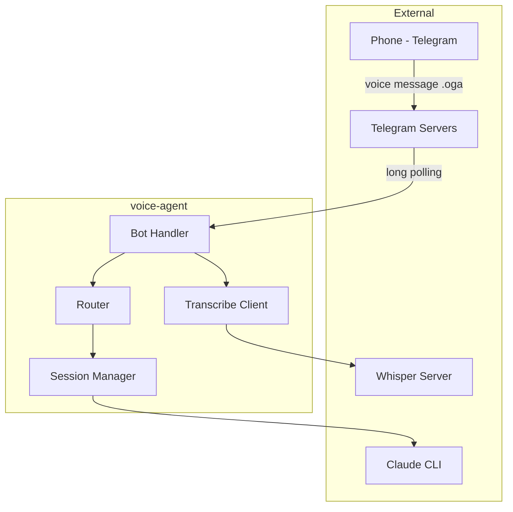

# Architecture Overview

## System Diagram

## Components

### Bot Handler (`bot.py`)

The main entry point. Handles Telegram updates:

- Receives voice messages via polling
- Downloads audio files from Telegram
- Coordinates transcription and session interaction
- Sends responses back to the user

### Transcribe Client (`transcribe.py`)

HTTP client for whisper-server:

- Sends audio data to `/transcribe` endpoint
- Returns transcribed text
- Handles errors and timeouts

### Router (`router.py`)

Parses user intent from transcribed text:

- Detects command keywords (approve, reject, status, etc.)
- Identifies project switching commands
- Routes to appropriate handlers

### Session Manager (`sessions/manager.py`)

Manages Claude sessions per chat:

- Creates and maintains sessions
- Tracks working directory and message count
- Handles session lifecycle
- Persists sessions via storage for restart survival
- Supports session resume via Claude's `--resume` flag

### Session Storage (`sessions/storage.py`)

JSON-based session persistence:

- Saves session state (chat_id, cwd, message_count, claude_session_id)
- Restores sessions on bot startup
- Handles corrupted files gracefully

### Permission Handler (`sessions/permissions.py`)

Handles tool permission requests:

- Auto-approves safe operations
- Queues dangerous operations for user approval
- Manages approval/denial via voice commands

## Data Flow

1. **Voice Input**: User sends voice message via Telegram
2. **Download**: Bot downloads .oga audio file
3. **Transcription**: Audio sent to whisper-server
4. **Routing**: Transcribed text parsed for intent
5. **Execution**:
   - Commands (status, approve) handled directly
   - Prompts sent to Claude CLI
6. **Response**: Claude's output sent back via Telegram

## External Dependencies

| Service | Purpose |
|---------|---------|
| Telegram Bot API | Receive voice messages, send responses |
| Whisper Server | Audio transcription |
| Claude CLI | Code assistant (uses its own auth via `claude login`) |
