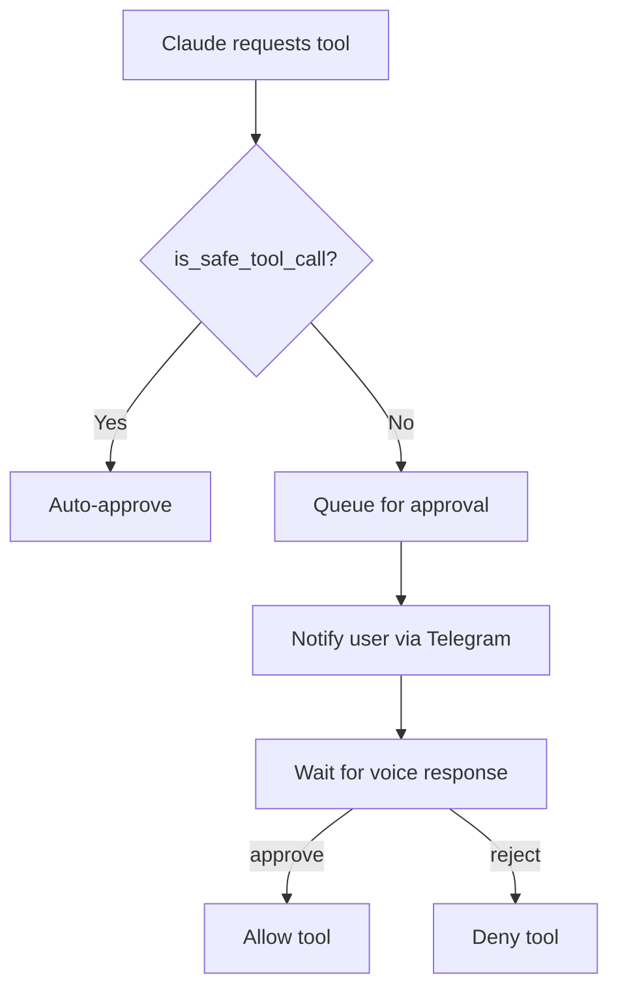

# Permission Model

## Overview

voice-agent implements a permission system to protect against unintended file modifications or command execution. Safe operations are auto-approved, while potentially dangerous operations require explicit user approval via voice.

## Auto-Approved Operations

These tools are considered safe and don't require approval:

| Tool | Reason |
|------|--------|
| `Read` | Read-only file access |
| `Glob` | File pattern matching |
| `Grep` | File content search |
| `WebSearch` | Web queries |
| `WebFetch` | Web content retrieval |

## Auto-Approved Bash Commands

Read-only bash commands are auto-approved:

- `ls`, `cat`, `head`, `tail`
- `pwd`, `echo`, `which`
- `git status`, `git log`, `git diff`, `git branch`, `git show`

## Requiring Approval

These operations require explicit user approval:

| Tool | Risk |
|------|------|
| `Write` | Creates or overwrites files |
| `Edit` | Modifies existing files |
| `Bash` (write commands) | `rm`, `mv`, `cp`, `chmod`, `git push`, etc. |
| `NotebookEdit` | Modifies Jupyter notebooks |

## Approval Flow



## Voice Commands for Permissions

| Say this | Effect |
|----------|--------|
| "yes", "approve", "ok", "continue" | Approve pending permission |
| "no", "reject", "stop", "cancel" | Deny pending permission |

## Timeout Behavior

If the user doesn't respond within `PERMISSION_TIMEOUT` seconds (default: 300), the permission is automatically denied.

## Implementation

```python
async def request_permission(
    self, tool_name: str, input_data: dict
) -> tuple[bool, str | None]:
    # Auto-approve safe tools
    if is_safe_tool_call(tool_name, input_data):
        return True, None

    # Create pending permission
    self.pending = PendingPermission(
        tool_name=tool_name,
        input_data=input_data
    )

    # Notify user
    if self.notify_callback:
        await self.notify_callback(tool_name, input_data)

    # Wait for response with timeout
    try:
        await asyncio.wait_for(
            self.pending.event.wait(),
            timeout=self.timeout
        )
        return self.pending.state == PermissionState.APPROVED, None
    except asyncio.TimeoutError:
        return False, "Permission request timed out"
```
