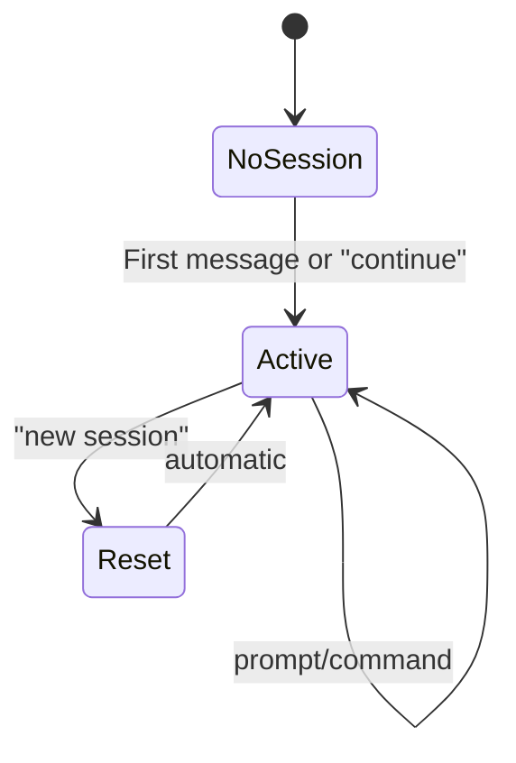

# Session Lifecycle

## Overview

voice-agent maintains one Claude session per Telegram chat. Sessions track working directory, message count, and pending permissions.

## Session States



Persisted sessions survive bot restarts. Say "continue" to resume previous context.

## Session Data

Each session stores:

```python
@dataclass
class Session:
    chat_id: int              # Telegram chat ID
    cwd: str                  # Working directory
    created_at: datetime      # Session start time
    message_count: int        # Messages exchanged
    permission_handler: PermissionHandler
    process: subprocess.Popen | None
    claude_session_id: str | None  # For resuming Claude context
```

## Persistence

Sessions are persisted to JSON via `SessionStorage`:

```python
@dataclass
class StoredSession:
    chat_id: int
    cwd: str
    created_at: str  # ISO format
    message_count: int
    claude_session_id: str | None
```

On startup, the bot restores all persisted sessions.

## Creating Sessions

Sessions are created on-demand when the first message arrives:

```python
def get_or_create(self, chat_id: int, cwd: str | None = None) -> Session:
    if chat_id not in self.sessions:
        session = Session(
            chat_id=chat_id,
            cwd=cwd or self.default_cwd,
        )
        self.sessions[chat_id] = session
    return self.sessions[chat_id]
```

## Resetting Sessions

Say "new session" to reset:

```python
def create_new(self, chat_id: int, cwd: str | None = None) -> Session:
    # Clean up old session
    if chat_id in self.sessions:
        old = self.sessions[chat_id]
        if old.process:
            old.process.terminate()

    # Create fresh session
    session = Session(chat_id=chat_id, cwd=cwd or self.default_cwd)
    self.sessions[chat_id] = session
    return session
```

## Changing Working Directory

Say "work on PROJECT" to switch directories:

```python
def set_cwd(self, chat_id: int, cwd: str) -> Session:
    session = self.get_or_create(chat_id)
    session.cwd = cwd
    return session
```

## Session Status

Say "status" to see:

```
Working directory: /code/project
Messages: 15
Age: 1h 23m
Pending approval: Write file: /tmp/test.txt
```

## Persistence and Resume

Sessions are now persisted to `sessions.json` (configurable via `SESSION_STORAGE_PATH`):

- Sessions survive bot restarts
- `claude_session_id` enables resuming Claude context
- Say "continue" to resume with full conversation history

```python
# Resume uses --resume flag
cmd = ["claude", "--print", "--dangerously-skip-permissions"]
if session.claude_session_id:
    cmd.extend(["--resume", session.claude_session_id])
cmd.append(prompt)
```

## Memory Management

For long-running deployments, consider:

- Periodic cleanup of old sessions from storage
- Maximum session age limits
- Session count limits per user
