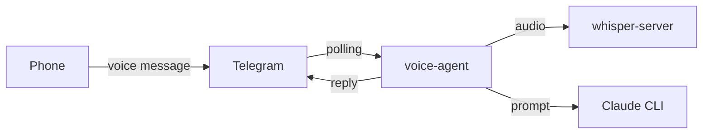

# voice-agent

Voice control for Claude Code via Telegram.

## Overview

voice-agent is a Telegram bot that lets you control Claude Code sessions using voice messages. Send a voice message from your phone, and it gets transcribed and sent to Claude Code. Responses come back as text messages.

## Features

- **Voice-to-text**: Send voice messages that get transcribed via whisper-server
- **Permission handling**: Approve or reject tool usage with voice commands
- **Session management**: Maintain persistent Claude sessions per chat
- **Project switching**: Switch between different working directories
- **Whitelist**: Restrict access to specific Telegram chat IDs

## Quick Start

1. Set up environment variables:
   ```bash
   export TELEGRAM_BOT_TOKEN="your-bot-token"
   export WHISPER_URL="http://localhost:8080/transcribe"
   export ALLOWED_CHAT_IDS="123456789"
   ```

2. Run the bot:
   ```bash
   nix run
   # or
   python -m voice_agent
   ```

3. Send a voice message to your bot on Telegram

## Architecture



## Requirements

- Python 3.11+
- A running whisper-server instance
- Telegram Bot token (from @BotFather)
- Claude CLI installed and authenticated (`claude login`)

## Links

- [Installation](getting-started/installation.md)
- [Configuration](getting-started/configuration.md)
- [Voice Commands](guides/voice-commands.md)
